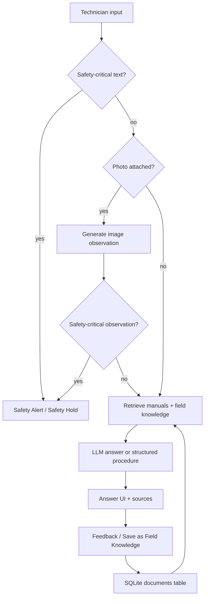

# Technician AI

**Technician AI is a factory knowledge assistant for technicians.**

It helps teams turn company manuals, SOPs, repair guides, inspection sheets,
drawings, spreadsheets, and field experience into a searchable knowledge
library for day-to-day troubleshooting.

[](https://opensource.org/licenses/MIT)
[](https://www.python.org/)
[](https://fastapi.tiangolo.com/)
[](https://react.dev/)
[](https://www.sqlite.org/)
[](https://web.dev/progressive-web-apps/)

[Quickstart](#quickstart) | [Demo Walkthrough](#demo-walkthrough) | [Architecture](#architecture) | [API Overview](#api-overview)

## What It Does

Technician AI gives factory technicians a mobile-friendly app for:

- Searching company manuals, SOPs, repair guides, drawings, inspection sheets, and Excel/CSV files.
- Asking questions with citations from the factory knowledge library.
- Diagnosing issues with safety-first routing before normal troubleshooting.
- Attaching photos of machines, alarm screens, damaged parts, work areas, or safety concerns.
- Receiving structured step-by-step instruction cards when that mode is enabled.
- Saving verified field experience back into the same knowledge library.

This is an alpha/local prototype, not a production safety system. It is designed
to help technicians retrieve and structure knowledge, while preserving escalation
to supervisors, EHS, and qualified maintenance when appropriate.

## Feature Highlights

### Factory Knowledge Library

The app presents the current SQLite database and `manuals/` folder as a default
Factory Knowledge Library. Each company or factory can upload its own manuals,
SOPs, repair guides, inspection sheets, drawings, Excel files, and field notes.

The library has two knowledge layers in the same local SQLite-backed store:

- **Official documents**: ingested as `manual_chunk` records.
- **Field knowledge**: saved as searchable `knowledge_entry` records.

These are not separate databases. They are two searchable layers in one local
knowledge library.

### Ask With Citations

Ask a normal technician question and Technician AI retrieves relevant snippets
from manuals and field knowledge before answering. Sources are shown below the
answer and citation markers such as `[#1]` map back to retrieved records.

### Safety Gate

Safety-critical inputs are routed before normal retrieval or LLM troubleshooting.
The deterministic Safety Gate is used across:

- Normal Ask
- Diagnosis
- Photo Ask text input
- Photo Ask generated image observation

If a hazard is detected, Technician AI returns the existing Safety Alert flow
with empty normal sources instead of giving troubleshooting steps.

Current deterministic coverage includes hazards such as broken glass, exposed
wires, smoke/fire/sparks, chemical leaks, unexpected machine movement, personnel
inside a machine, injuries, and unknown emergency-stop situations.

### Guided Diagnosis

Diagnosis mode keeps a session history and asks focused follow-up questions.
It uses the same safety-first routing and can hold the session in a safety state
until required confirmations are provided.

### Photo-Based Ask

Technicians can attach a JPEG, PNG, or WebP image with a question. The app:

1. Runs the Safety Gate on the text question.
2. Generates an AI image observation from the uploaded photo.
3. Runs the Safety Gate on that image observation.
4. Uses the question plus image observation for normal RAG retrieval.

Raw uploaded images are not stored permanently.

### Step-By-Step Instruction Mode

Ask can optionally request structured instruction cards:

- Safety first
- Tools needed
- Numbered steps
- Expected result
- When to stop and ask a supervisor

Safety-critical inputs still return a Safety Alert instead of step instructions.
Step instructions should not replace site procedures, supervisor judgment, or
lockout/tagout requirements.

### Structured Field Knowledge Capture

After an answer, technicians can save a field finding as structured knowledge:

- Problem / symptom
- Machine
- Component
- What was tried
- What actually fixed it
- Confidence
- Additional technician note

The backend stores this as `documents.kind="knowledge_entry"` with structured
metadata and a readable searchable text body.

## Quickstart

### 1. Clone And Install Backend

```bash
git clone https://github.com/33Ye33/Technician-AI.git
cd Technician-AI

python3 -m venv .venv
source .venv/bin/activate
pip install -r requirements.txt
```

### 2. Configure Environment

```bash
cp .env.example .env
```

Open `.env` and set at least one LLM provider/API key.

Common options:

| Provider | Required key | Example model |
|---|---|---|
| Google Gemini | `GOOGLE_API_KEY` | `gemini-2.0-flash` |
| OpenAI | `OPENAI_API_KEY` | `gpt-4o` |
| Anthropic Claude | `ANTHROPIC_API_KEY` | `claude-sonnet-4-6` |

Photo Ask requires a vision-capable provider/model. You can set
`TECHNICIAN_AI_VISION_MODEL` separately from the normal text model.

Embeddings are optional. Without an embedding provider, Technician AI falls back
to keyword search, which is enough for small demos.

### 3. Build Frontend

```bash
cd frontend
npm install
npm run build
cd ..
```

### 4. Run App

```bash
python app.py
```

Open [http://localhost:8000](http://localhost:8000).

`app.py` binds to `0.0.0.0` and prints a LAN URL plus QR code when possible, so
you can test from a phone on the same WiFi network.

## Demo Walkthrough

Use this sequence to show the current completed features.

### 1. Upload Factory Knowledge

Open the app and choose **Upload Knowledge** or **Add to Knowledge Library**.
Upload one or more files:

- Manual PDF
- SOP
- Repair guide
- Inspection checklist
- Drawing
- Excel or CSV file

The file is stored under `manuals/`, chunked, and indexed in SQLite.

### 2. Ask A Normal Question

Try:

```text
Machine 3 has a low vacuum alarm. What should I check?
```

Expected demo points:

- Technician AI answers from retrieved library content.
- Sources appear below the answer.
- The answer can be rated and marked as worked or not worked.

### 3. Turn On Step-By-Step Mode

Enable **Step-by-step** and ask the same question again.

Expected demo points:

- The response appears as instruction cards.
- Sources still appear below the procedure.
- The cards include safety, tools, steps, expected result, and supervisor stop conditions.

### 4. Attach A Photo

Attach a photo of an alarm screen, machine area, or part and ask:

```text
What should I check from this photo?
```

Expected demo points:

- The backend generates an **Image observation**.
- The observation is included in the final answer.
- The answer still uses normal library retrieval and citations when sources are found.

Note: the image observation is AI-generated and is not a confirmed diagnosis.

### 5. Trigger The Safety Gate

Try a safety-critical input:

```text
Someone is reaching inside the machine and the arm moved suddenly.
```

Expected demo points:

- Safety Alert appears before normal troubleshooting.
- No normal manual retrieval sources are cited.
- Diagnosis mode also enters the safety hold/check behavior for hazards.

### 6. Save Field Knowledge

After a useful answer, click **Save as Field Knowledge** and enter:

- Problem / symptom
- Machine
- Component
- What was tried
- What actually fixed it
- Confidence
- Technician note

Expected demo points:

- The field note is stored as `knowledge_entry`.
- Structured metadata is kept with the record.
- A readable text body is generated so future search can find it.

### 7. Retrieve Saved Field Knowledge

Ask a related question using the same machine, component, symptom, or fix
keywords. The saved field knowledge should be eligible for retrieval alongside
manual content.

## Configuration Reference

Important environment variables are documented in [.env.example](.env.example).

| Variable | Purpose |
|---|---|
| `LLM_PROVIDER` | Optional explicit provider: `google`, `openai`, or `anthropic`. |
| `TECHNICIAN_AI_MODEL` | Main text model. |
| `TECHNICIAN_AI_VISION_MODEL` | Vision-capable model for Photo Ask. |
| `PHOTO_ASK_MAX_BYTES` | Max uploaded photo size in bytes. |
| `EMBED_PROVIDER` | Optional embedding provider: `voyage`, `google`, or `openai`. |
| `TECHNICIAN_AI_DB` | SQLite database path. |
| `USE_VISION_INGEST` | Enables vision extraction during document ingestion. |
| `USE_LLM_TAGGER` | Enables LLM topic tagging for ingested docs/knowledge. |

## Architecture



### Data Storage

Technician AI uses local SQLite by default:

- `documents`: manuals, SOP chunks, field knowledge entries
- `conversations`: Ask responses, ratings, feedback
- `diagnose_sessions`: diagnosis history, resolution, feedback

Uploaded source files are stored in `manuals/`. Raw photos submitted to
`/api/ask/photo` are used for the request and not stored permanently.

## API Overview

The React app uses these JSON endpoints:

| Endpoint | Purpose |
|---|---|
| `POST /api/ask` | Text Ask. Accepts `question` and optional `step_by_step`. |
| `POST /api/ask/photo` | Photo Ask. Accepts `question`, `image`, optional `step_by_step`. |
| `POST /api/diagnose` | Start guided diagnosis. |
| `POST /api/diagnose/step` | Continue diagnosis session. |
| `POST /api/ingest` | Upload a manual/SOP/checklist file. |
| `GET /api/manuals` | List indexed manuals. |
| `GET /api/manuals/files` | List uploaded files in `manuals/`. |
| `GET /api/knowledge` | List field knowledge entries. |
| `GET /api/topics` | List topic buckets. |
| `POST /api/field-knowledge` | Save structured field knowledge. |
| `POST /api/feedback/{conversation_id}` | Save worked/did-not-work feedback. |
| `POST /api/conversations/{conversation_id}/rating` | Save Ask rating/comment. |
| `POST /api/diagnose/sessions/{session_id}/feedback` | Save diagnosis rating/comment. |

## Project Layout

```text
technician_ai/
  api.py          FastAPI routes and SPA serving
  retrieval.py    Ask RAG, photo Ask answer flow, step mode, feedback capture
  diagnosis.py    evidence-controlled diagnosis state machine
  safety.py       deterministic safety gate
  ingestion.py    PDF/PPTX/DOCX/Excel ingestion
  database.py     SQLite schema and queries
  llm.py          LLM and vision provider adapter
  embeddings.py   optional embedding provider adapter
  tagging.py      topic and entry-type classification

frontend/         React + Vite + Tailwind PWA
manuals/          uploaded source files
static/           built frontend served by FastAPI
templates/        legacy server-rendered fallback UI
tests/            unit and regression tests
```

## Tests And Build

Run backend tests:

```bash
.venv/bin/python -m unittest discover -s tests
```

Build frontend:

```bash
cd frontend
npm run build
```

## Limitations

- Local SQLite prototype; not a production multi-tenant system.
- Requires a configured LLM provider for generated answers.
- Photo Ask requires a vision-capable LLM provider/model.
- Image observation is AI-generated and should not be treated as a confirmed diagnosis.
- Step-by-step instructions should not replace supervisor judgment, EHS rules, qualified maintenance procedures, or lockout/tagout procedures.
- Safety Gate is deterministic keyword/pattern routing; it reduces risk but does not replace site safety systems.
- Uploaded photos are not stored permanently; there is no image database or annotation workflow.

## Roadmap

Shipped:

- Factory Knowledge Library UI
- Upload and search manuals, SOPs, repair guides, inspection sheets, drawings, and Excel files
- Ask with citations
- Structured Field Knowledge Capture
- Strengthened Safety Gate for Ask, Diagnosis, and Photo Ask
- Photo-based Ask / multimodal question flow
- Step-by-step instruction mode
- Mobile-friendly PWA shell

Possible next steps:

- Photo support inside Diagnosis mode
- Real multi-company or multi-factory workspaces
- Deployment guide for a shared team/server environment
- Direct field knowledge entry form outside feedback
- Better validation/review workflow for field knowledge
- Video, AR, annotations, and object detection later
- pgvector or external vector database for larger deployments

## Contributing

PRs are welcome. Good areas for contribution:

- Better ingestion for real factory document formats
- Safety trigger tests and safer response templates
- UI polish for mobile technicians
- Deployment documentation
- Evaluation datasets and regression tests

Open an issue first for larger architecture changes.

## License

MIT
