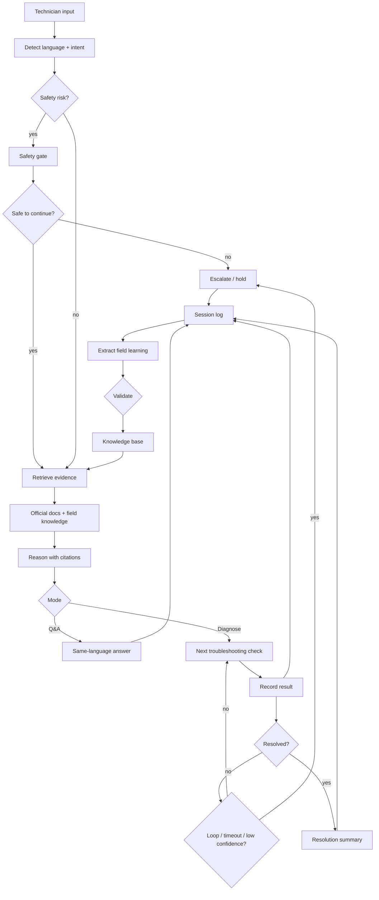

<div align="center">

# Technician AI

**The open-source knowledge layer for people who fix, build, and assemble things for a living.**

Pulls answers from manufacturer manuals — and captures the field-learned tricks that never make it into them.

[](https://opensource.org/licenses/MIT)
[](https://www.python.org/)
[](#roadmap)
[](https://ai.google.dev/)
[](https://fastapi.tiangolo.com/)
[](https://www.sqlite.org/)
[](https://react.dev/)
[](https://web.dev/progressive-web-apps/)
[](#quickstart)
[](#contributing)
[](https://github.com/AXora009/Technician-AI)

[Quickstart](#quickstart) · [Agent Design](#agent-design) · [Key Capabilities](#key-capabilities) · [Roadmap](#roadmap) · [Contributing](#contributing)

</div>

---

## The problem

In every factory, repair shop, and assembly line, the most valuable knowledge **isn't in the manual** — it's in the heads of the senior technicians.

- The torque trick that prevents a rework.
- The bolt that strips at 40Nm even though spec says 50.
- The vendor PDF that's plain wrong about the lubrication schedule.
- The "if you see this EL pattern, check the welding head before anything else" intuition built over a thousand units.

That knowledge walks out the door at 5pm, retires every year, and gets re-learned the hard way by every new hire.

## What Technician AI does

Technician AI is an agent workflow for factory and field troubleshooting:

| | |
|---|---|
| **`retrieve`** | Search manuals, SOPs, drawings, inspection sheets, and prior field fixes. |
| **`diagnose`** | Guide technicians through safe, evidence-controlled troubleshooting. |
| **`capture`** | Record every question, answer, step tried, outcome, and new field discovery. |
| **`learn`** | Turn resolved sessions and technician notes into reusable knowledge entries. |
| **`escalate`** | Detect safety risk, troubleshooting loops, or long unresolved sessions and route to a supervisor or senior support. |

The goal is not just to answer from manuals. The goal is to make every troubleshooting session improve the knowledge base.

---

## Key Capabilities

### Session Memory + Knowledge Capture
- Records the full troubleshooting trail: user questions, AI suggestions, technician replies, steps attempted, final resolution, and unresolved findings
- Converts field-discovered issues that are missing from manuals or SOPs into a separate searchable knowledge repository
- Reuses prior resolved cases alongside official documentation on future questions

### Safety-First Diagnosis
Before any troubleshooting begins, the system detects safety-critical incidents:
- **Broken glass** near moving equipment
- **Unexpected pneumatic movement** / pinch risk
- **Electrical hazards** — sparks, live wires, burning smell
- **Personnel inside the machine**, fire, chemical release

For each hazard type, a deterministic **Safety Gate** issues source-grounded immediate actions and a prerequisite checklist. Normal diagnosis only begins after all safety confirmations are received.

### Evidence-Controlled Diagnosis
The Diagnose flow uses a finite-state machine with structured evidence quality tracking:
- Classifies each technician answer as `CONFIRMED`, `APPROXIMATE`, `SUSPECTED`, `HEARSAY`, or `NEGATIVE`
- Blocks `HIGH` confidence resolution when all evidence is uncertain or hedged
- Separates *confirmed blocking condition* from *suspected cause* and *alternative possibilities*
- Enforces minimum evidence requirements before resolution

### Multilingual Interaction
- Detects the user's input language automatically
- Answers in the same language during Q&A and troubleshooting
- Keeps stored knowledge language-aware so multilingual teams can search and reuse the same operational memory

### Escalation Control
- Tracks long or repetitive troubleshooting sessions
- Flags unresolved loops and time thresholds, for example 30 minutes without progress
- Prompts escalation to a supervisor, EHS, maintenance engineer, or higher-level technical support when the current workflow is no longer productive

### Multi-Format Ingestion
- **PDF** — text extraction + optional vision AI for image-heavy pages (circuit diagrams, work instructions)
- **PPTX** — slide-by-slide extraction with speaker notes
- **DOCX** — section-aware extraction preserving table structure
- **XLSX / XLS** — each sheet converted to searchable Markdown tables

### Improved Retrieval
- Semantic vector search when embeddings are configured (Voyage, Google, OpenAI)
- Keyword-based fallback when no embedding provider is set — works out of the box
- Vision ingestion for graphical PDF pages that text extraction misses

### Mobile PWA
Installable on iOS and Android as a Progressive Web App — works like a native app, no app store required.

---

## Demo

Drop a manual into the system, ask a question, get a cited answer:

```
> What is the required air supply pressure for this machine?

The air supply pressure must be maintained at 0.5–0.7 MPa [#3].

Sources
  [#3] MANUAL — Maintenance Manual, section 2.2.23

[ Worked ]  [ Didn't work ]  [ I learned something ]
```

For a safety incident:

```
> A sheet of glass broke inside the machine near the robot arm.

## Safety Alert: Broken Glass

Broken glass inside an operating machine presents a serious laceration hazard.
Do not reach into the machine or approach moving mechanisms.

### Documented Immediate Actions
1. Keep machine doors closed and locked until it is confirmed safe to open them.
   Source: Glass Loading Manual — Hazard section
2. Wear proper PPE before any cleanup of broken glass.
   Source: Glass Loading Manual — Hazard section
3. Press Emergency Stop if there is any immediate risk to personnel, and report
   to supervisor and EHS immediately.
   Source: Glass Loading Manual — Hazard section

> For additional steps: Follow your site-approved procedure or contact your
> supervisor/EHS before proceeding further.

Before I continue: Is everyone clear of the machine, and is anyone injured?
```

---

## Quickstart

### 1. Clone and install

```bash
git clone https://github.com/AXora009/Technician-AI.git
cd Technician-AI

python3 -m venv .venv && source .venv/bin/activate   # Windows: .venv\Scripts\activate
pip install -r requirements.txt
```

### 2. Configure

```bash
cp .env.example .env
```

Open `.env` and set your LLM provider. Three options:

| Provider | Key to set | Model example |
|---|---|---|
| **Google Gemini** (free tier available) | `GOOGLE_API_KEY` | `gemini-2.5-flash` |
| **Anthropic Claude** | `ANTHROPIC_API_KEY` | `claude-sonnet-4-6` |
| **OpenAI-compatible** | `OPENAI_API_KEY` | `gpt-4o` |

Set `LLM_PROVIDER=google` (or `anthropic` / `openai`) to pick explicitly. Otherwise auto-detected from whichever key is present.

For embeddings (optional — improves retrieval quality significantly):

| Provider | Key to set |
|---|---|
| **Voyage AI** | `VOYAGE_API_KEY` |
| **Google** | `GOOGLE_API_KEY` |
| **OpenAI** | `OPENAI_API_KEY` |

See `.env.example` for all options.

### 3. Build the frontend

```bash
cd frontend
npm install
npm run build
cd ..
```

### 4. Ingest a manual

```bash
python ingest.py path/to/your-manual.pdf
python ingest.py "path/to/inspection-checklist.xlsx"
python ingest.py "path/to/work-instruction.docx"
```

Supported formats: `.pdf`, `.pptx`, `.docx`, `.xlsx`, `.xls`

For PDFs with circuit diagrams or image-heavy pages, enable vision extraction:
```bash
# In .env:
USE_VISION_INGEST=true
VISION_ALL_PAGES=true
VISION_PAGE_RANGE=1-30
```

### 5. Run

```bash
python app.py
```

Open **http://localhost:8000**. To share with others on the same network, run with `--host 0.0.0.0`.

---

## Agent Design

### 1. Knowledge Base

Technician AI uses two knowledge layers:

| Layer | What it stores | Purpose |
|---|---|---|
| **Official docs** | Manuals, SOPs, work instructions, drawings, inspection sheets | Grounded answers with citations |
| **Field knowledge** | Questions asked, AI answers, troubleshooting steps, outcomes, technician notes, new production findings | Living memory of what actually works on the line |

Every troubleshooting session becomes a structured record:

```
problem → context → retrieved evidence → AI suggestions
→ technician actions → result → resolution status
→ new field note / validated fix / escalation
```

Resolved sessions can be promoted into durable knowledge entries. Unresolved sessions remain searchable so teams can review what was tried before repeating work.

### 2. Agent Processing



The agent separates what the manual says, what prior technicians learned, and what is only suspected. It should not claim high confidence when the evidence is weak.

### 3. Answering Questions

For direct questions, the agent returns:
- The answer in the user's language
- Source citations from manuals or prior validated field notes
- Any conflict between official docs and field experience
- A feedback path: **Worked / Didn't work / I learned something**

For diagnosis, the agent runs a controlled loop:
- Confirm safety first
- Ask for symptoms and observations
- Recommend one or two concrete checks at a time
- Track each attempted step and result
- Stop when resolved, blocked, unsafe, or ready to escalate

### 4. Adding Knowledge Back

When a technician provides feedback or a session ends, the system structures the new knowledge:

```
raw note/session transcript
   ▼
LLM extracts: symptom, equipment, suspected cause, confirmed fix,
evidence quality, source session, language, tags
   ▼
human validation / confidence score
   ▼
searchable knowledge entry
```

The next technician asking a related question gets the manual answer plus the validated field fix.

### 5. Escalation Design

The agent should escalate instead of endlessly troubleshooting when:
- Safety is unresolved or the issue involves EHS risk
- The same checks are being repeated
- The session exceeds a configured time threshold, such as 30 minutes
- The user reports multiple failed attempts with no new evidence
- The model's confidence remains low after required evidence is collected

Escalation output should include a compact handoff packet:
- Original problem
- Timeline of questions and actions
- Evidence collected
- Steps already tried
- Current suspected causes
- Why escalation was triggered

```
  .pdf / .pptx / .docx / .xlsx
          │
          ▼
  ┌─────────────────────────────────────┐
  │  ingest.py                          │
  │  text extract → vision fallback     │
  │  chunk → embed (optional) → store   │
  └──────────────────┬──────────────────┘
                     ▼
         ┌───────────────────────┐
         │  SQLite               │
         │  manual_chunk +       │
         │  knowledge_entry      │
         └──────────┬────────────┘
                    │
  "What's the torque spec?"
           │        ▼
           ▼   vector search (or keyword fallback)
      embed query ────────▶ top-K snippets
                                  │
                     ┌────────────▼────────────────┐
                     │  Safety Gate                 │
                     │  (hazard detected → alert)   │
                     │                              │
                     │  Diagnosis FSM               │
                     │  SAFETY_HOLD → SYMPTOM       │
                     │  GATHERING → CAUSE NARROWING │
                     │  → RESOLVED                  │
                     └────────────┬────────────────┘
                                  ▼
                             cited answer
                                  │
                                  ▼
                    [ Worked ] [ Didn't ] [ I learned… ]
                                  │
                                  ▼
                    LLM structures note → embed → insert
                    → retrievable on next question
```

---

## Stack

| Layer | Choice | Why |
|---|---|---|
| **LLM** | Google Gemini / Anthropic Claude / OpenAI-compatible | Pluggable — use whatever provider works for you |
| **Embeddings** | Voyage AI / Google / OpenAI *(optional)* | Configurable via env vars; keyword fallback when unset |
| **Vision** | Gemini / Claude / GPT-4o *(optional)* | Extracts text from circuit diagrams and image-heavy PDFs |
| **Vector store** | SQLite + numpy cosine | Zero infra. Swap for pgvector when you outgrow it |
| **Backend** | FastAPI + Uvicorn | Async, typed, minimal |
| **Frontend** | React 19 + Vite + Tailwind CSS + shadcn/ui | Dark/light theming, PWA, installable on mobile |
| **Ingestion** | pypdf + python-pptx + python-docx + openpyxl + PyMuPDF | PDF, PPTX, DOCX, Excel |
| **Safety** | `safety_gate.py` + `diagnosis_fsm.py` | Deterministic pre-LLM hazard routing + evidence-quality FSM |

---

## Operating modes

| | With embeddings | Without |
|---|---|---|
| **Retrieval** | Semantic vector search | Keyword-based fallback |
| **Scales to** | Thousands of pages | A few short manuals |
| **Providers** | Voyage, Google, or OpenAI | Any LLM provider |

Start without embeddings to validate the loop. Add Voyage or Google embeddings when you ingest your second manual — retrieval quality improves noticeably on mixed-language or technical documents.

---

## Why this matters

Tribal knowledge has been a known problem in industry for decades. Every solution to date has had the same shape:
- A wiki nobody updates.
- A SharePoint folder nobody can find.
- A senior tech who answers the same question 200 times a year.
- A "lessons learned" doc collected after every incident, then never read again.

The reason these all fail is the same: **contribution friction**. If saving knowledge costs more than re-solving the problem, knowledge doesn't get saved.

Technician AI bets that LLMs finally close that gap. Three taps and one sentence is the contribution. The LLM does the structuring, the embedding, the searching, the retrieval. The technician just answers the question they were going to answer anyway.

---

## Roadmap

**Backbone (✓ shipped)**
- Polymorphic SQLite store, cosine retrieval, optional embeddings
- Citation-grounded answers, multi-provider LLM support (Gemini, Claude, OpenAI)
- PDF + PPTX + DOCX + Excel ingestion
- Vision extraction for circuit diagrams and image-heavy PDFs
- Three-tap feedback → structured knowledge entry
- **Safety Gate** — deterministic hazard routing before diagnosis
- **Diagnosis FSM** — evidence-quality controls, SAFETY_HOLD enforcement
- Progressive Web App — installable on iOS and Android

**Agent Workflow (next)**
- Full session memory: every question, answer, troubleshooting step, outcome, and final resolution
- Session-to-knowledge promotion for production discoveries missing from manuals or SOPs
- Automatic language detection and same-language answers across Q&A and diagnosis
- Escalation triggers for repeated loops, low-confidence diagnosis, safety risk, and long unresolved sessions
- Supervisor handoff packet with timeline, evidence, attempted fixes, and suspected causes

**Product UX (next)**
- Voice input on the answer page (mobile-first capture)
- Photo attachment on knowledge entries
- "Conflict surfaced" UI when manual and field note disagree
- Per-knowledge-entry validation count and decay
- Retrieval routing by document type (circuit diagram vs. SOP vs. checklist)
- pgvector backend for >100K chunks

**Beyond**
- Multi-tenant deployment story
- Equipment / parts ontology
- Real-time collaboration on a single fix-in-progress

---

## Contributing

This is open source because the problem is bigger than any single team. PRs welcome on:

- New ingestion formats (`.html`, video transcripts, P&ID diagrams)
- Alternative LLM/embedding providers (drop-in adapters)
- UI improvements (the v0 is intentionally bare; bring taste)
- Real-world test corpora and example datasets
- Documentation and translations

Open an issue first for anything bigger than a bug fix so we can align on direction.

---

## Acknowledgments

Built on the shoulders of giants — Google Gemini, Anthropic Claude, FastAPI, SQLite, React, Tailwind CSS, shadcn/ui, Voyage AI, and the long lineage of people who figured out how to capture institutional knowledge before us.

---

## License

MIT — do whatever you want with it. If you ship something using this, drop a link in the issues. We'd love to see it.

---

<div align="center">

**If this resonates, star the repo — it's how the project grows.**

[](https://github.com/AXora009/Technician-AI/stargazers)

</div>
